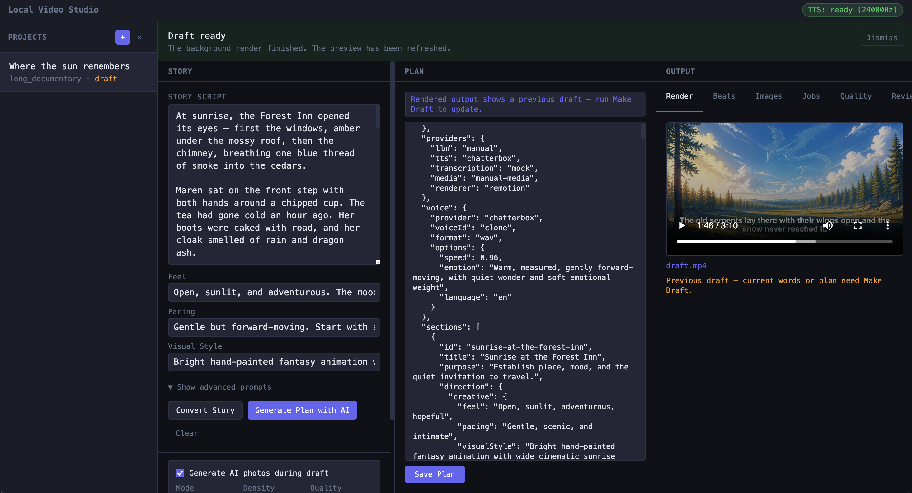
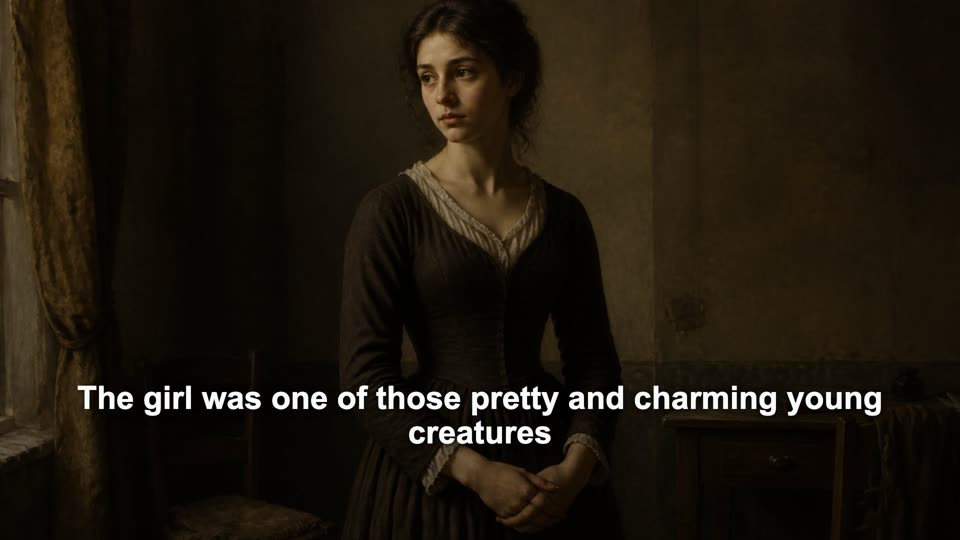
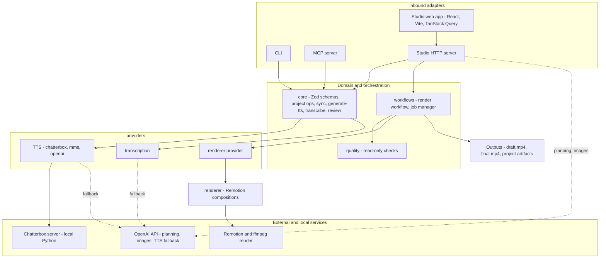
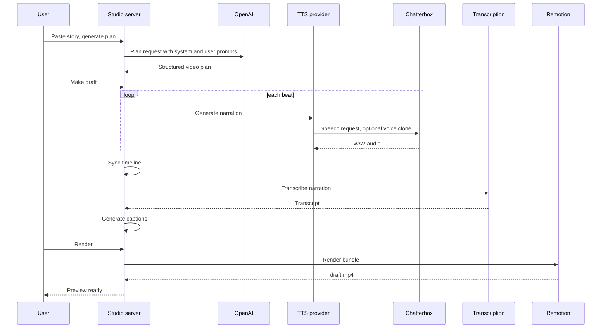
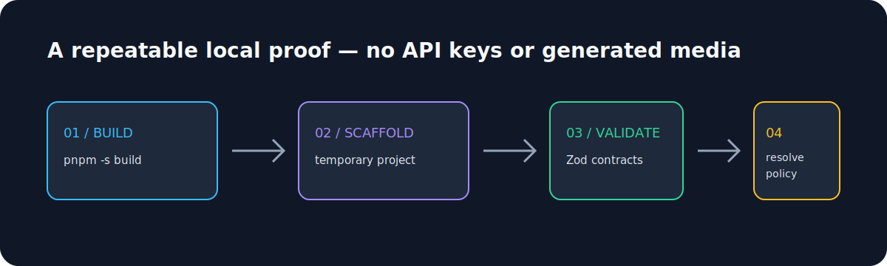

# Scriptorium Video

Scriptorium Video is a local-first video studio for planning, assembling, reviewing, and rendering narrated videos from structured project data. It combines a Studio web app, CLI, MCP server, provider adapters, shared Zod domain schemas, quality checks, and a Remotion renderer.

This is a personal engineering project. The repo is public for code review and portfolio use, not a hosted SaaS product or packaged npm library.



_One screen, end to end: paste a story (left), generate a structured production plan with AI (center), then narrate, render, and review the video (right). Narration runs locally through Chatterbox; rendering is handled by Remotion._

## Quick Look

- **Run the app:** `pnpm start:full`
- **Open Studio:** `http://localhost:4173`
- **Run the full gate:** `pnpm -s verify`
- **Run the deterministic portfolio proof:** `bash docs/portfolio-demo.sh`
- **Sample output:** see the compressed render preview below

## Sample Render

[](docs/media/the-gurl-sample.mp4)

This short preview was produced by the local Studio workflow using Chatterbox narration and the Remotion renderer. The full local render used to make this preview is `content/projects/the-gurl/renders/draft.mp4`; generated project artifacts remain ignored, so only this compressed documentation sample is tracked.

## What It Demonstrates

- Monorepo architecture with clear package and app boundaries.
- Shared domain contracts built around canonical Zod schemas.
- Thin HTTP, CLI, and MCP adapters that delegate to named workflow modules.
- React 19 + Vite + TypeScript Studio UI with TanStack Query and focused component tests.
- Remotion rendering separated from orchestration and provider logic.
- Provider integrations for planning, image generation, transcription, narration, and local-first media flows.
- Structural guardrails, linting, formatting, type checks, and package-owned tests composed by one verification command.

## Architecture

A small monorepo with a strict dependency direction: a canonical `core`, provider adapters and quality checks built on it, render orchestration on top, and three thin inbound adapters (CLI, MCP, Studio) that validate input and delegate. The renderer is consumed only through a provider, never imported directly by orchestration.



_Solid edges are explicit, verified in each package manifest and entrypoint (`core` has no internal deps; `providers`, `quality`, and `renderer` depend on `core`; `workflows` adds `quality`; CLI, MCP, and Studio depend on all four). Dashed edges are runtime fallbacks to the OpenAI API._

### How a draft is produced



Plan generation and optional image work go through OpenAI; per-beat narration runs locally through the Chatterbox TTS server with optional voice cloning; rendering is handled by Remotion.

## Workflow

The production path is intentionally explicit:

| Stage     | What Happens                                                                  |
| --------- | ----------------------------------------------------------------------------- |
| Plan      | Story input or `video-plan.json` is normalized through the core schemas.      |
| Sync      | Project data is converted into timeline and render-bundle friendly artifacts. |
| Narration | TTS providers create beat-level voice assets.                                 |
| Captions  | Transcription and caption generation produce timed text artifacts.            |
| Images    | Optional image providers create or reuse visual assets.                       |
| Quality   | Read-only checks inspect the prepared project and generated artifacts.        |
| Render    | Remotion consumes the prepared bundle and writes `draft.mp4` or `final.mp4`.  |

Generated media and per-project artifacts are local state by default. The repository tracks source code, tests, docs, and small curated documentation samples, not normal Studio output.

## Portfolio Case Study

The useful claim here is not that this is a finished video product. It is that the codebase has a deliberate, testable shape for a local video workflow: shared contracts, thin adapters, focused orchestration, provider boundaries, and a renderer that consumes prepared bundles.



**Problem:** a video-production tool needs to coordinate mutable local files, provider work, quality checks, and rendering without turning every user surface into a second application.

**Design:** canonical Zod contracts live in `packages/core`; CLI, MCP, Studio HTTP routes, and React UI validate and delegate; provider adapters stay separate from workflow decisions; the Remotion app receives a prepared render bundle instead of reading project state.

**Evidence:** runnable boundary checks protect those choices alongside linting, type checks, package-owned tests, and `pnpm -s verify`.

Run the deterministic proof locally:

```bash
bash docs/portfolio-demo.sh
```

The script builds the workspace, creates a short-form `portfolio_site` project in a temporary directory, validates its canonical contracts, resolves its declared production policy, prints the generated project shape, and removes the temporary directory. It makes no network calls, requires no API key, and does not generate media. See the [representative output](docs/portfolio-demo-output.txt).

For the full production path, use a real local project and follow `validate -> sync -> check -> render`; provider-backed narration, images, captions, and rendered media are intentionally opt-in because they can require credentials, local services, or substantial assets.

## Workspace Map

| Workspace             | Responsibility                                                                            |
| --------------------- | ----------------------------------------------------------------------------------------- |
| `packages/core`       | Domain schemas, validation, project paths, config resolution, and render-bundle contracts |
| `packages/providers`  | Concrete provider adapters for external and local services                                |
| `packages/quality`    | Read-only quality checks and reports                                                      |
| `packages/cli`        | Command-line interface wiring                                                             |
| `packages/mcp-server` | MCP tools for project operations                                                          |
| `apps/studio`         | Local HTTP server, workflow orchestration, job state, and Studio web app                  |
| `apps/renderer`       | Remotion compositions and render-time presentation                                        |

## Requirements

- Node.js 22
- pnpm 10.11.0
- Optional `ffmpeg` / `ffprobe` for smoke tests and rendered media inspection
- Optional local services or API credentials for provider-backed planning, images, TTS, and transcription

## Quick Start

```bash
pnpm install
pnpm start:full
```

`pnpm start:full` ensures the local Chatterbox Python environment exists, builds the packages, builds the web SPA, and launches the Studio server in one command. It defaults to `http://localhost:4173`.

To stop everything (Studio plus the detached Chatterbox process it spawns):

```bash
pnpm stop:full
```

The server autostarts the local Chatterbox TTS server on demand when a narration job runs. If you want to set up Chatterbox separately, run:

```bash
pnpm setup:chatterbox   # one time; re-run after a reboot if the venv lives under /private/tmp
```

For provider-backed flows such as OpenAI planning, image generation, or TTS, copy `.env.example` into your local shell or an ignored env file and provide the required credentials or local service URLs. Do not commit real secrets.

## Useful Commands

| Command                | Purpose                                           |
| ---------------------- | ------------------------------------------------- |
| `pnpm start:full`      | Start Studio plus the local Chatterbox setup path |
| `pnpm stop:full`       | Stop Studio and the local Chatterbox process      |
| `pnpm -s verify`       | Run the full repository gate                      |
| `pnpm -s build`        | TypeScript project build                          |
| `pnpm -s test`         | Package-owned tests                               |
| `pnpm lint`            | ESLint with the current warning baseline          |
| `pnpm format:check`    | Prettier check                                    |
| `pnpm mcp:server`      | Build and run the MCP server                      |
| `pnpm lvstudio --help` | CLI entry point after build                       |

`pnpm -s verify` is the main gate. It runs formatting checks, linting, TypeScript builds, package tests, Studio web tests, and boundary checks that keep orchestration, schemas, renderer code, and environment access in the right layers.

## Architecture Notes

The main design constraint is that adapters should not become the application. Route handlers, CLI commands, MCP tools, and React components validate input, wire dependencies, call focused workflow or domain modules, and map the result back to their surface.

The repo enforces that through focused modules and runnable checks:

- Renderer code stays out of core, CLI, and Studio orchestration.
- Planner and video-plan schemas are owned by `packages/core`.
- Studio environment reads are centralized in runtime config helpers.
- Tests that depend on built artifacts compile their package first.
- The Studio server entrypoint remains a bootstrap file instead of a business-logic container.

The durable agent/developer contract lives in `AGENTS.md`; it is included because this repo intentionally treats architecture guidance and mechanical checks as part of the engineering system.

## Current Status

This project is active and local-first. It is suitable for reviewing architecture, testing strategy, frontend decomposition, workflow orchestration, and media-rendering boundaries.

Known product rough edges remain. The Studio can run the full draft workflow, but workflow step visibility and true checkpoint-style resume semantics are still areas for improvement.

Generated media, local Studio state, rendered outputs, captions, and per-project artifacts are intentionally ignored, except for small curated documentation samples under `docs/media/`.
