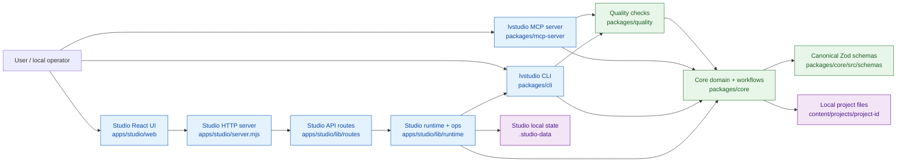
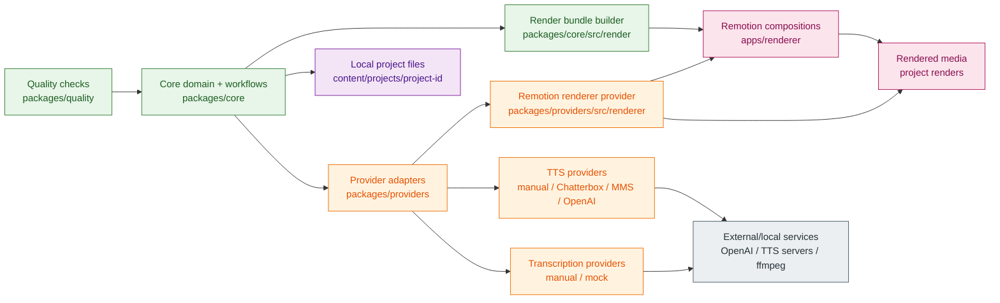
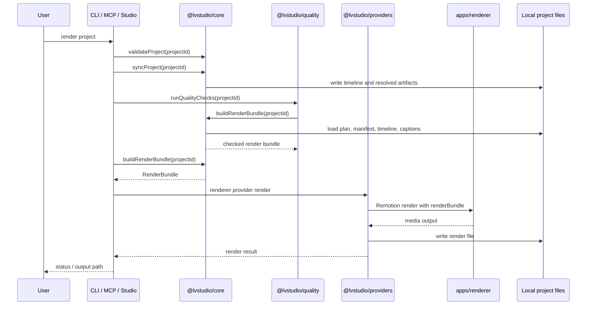

# Scriptorium Architecture Diagram

Generated: 2026-06-09
Scope: repository-level architecture for the local-first video production system.

Evidence read:

- `AGENTS.md`
- `README.md`
- `package.json`
- `pnpm-workspace.yaml`
- `packages/core/src/index.ts`
- `packages/core/src/render/build-render-bundle.ts`
- `packages/cli/src/index.ts`
- `packages/mcp-server/src/index.ts`
- `packages/providers/src/index.ts`
- `packages/quality/src/index.ts`
- `apps/studio/server.mjs`
- `apps/studio/lib/runtime/studio-runtime.mjs`
- `apps/studio/lib/runtime/studio-api-context.mjs`
- `apps/studio/lib/routes/studio-routes.mjs`
- `apps/studio/lib/routes/studio-http-handler.mjs`
- `apps/studio/web/src/api/client.ts`
- `apps/renderer/src/index.ts`
- `apps/renderer/src/Root.tsx`

## Inbound Adapters To Core

## Core To Providers And Output

## Primary Render Flow

## Notes

- Explicit: `packages/cli` and `packages/mcp-server` import core workflows, provider registries, and quality checks directly.
- Explicit: Studio serves the React app, builds a runtime, routes API requests through focused route modules, and delegates operations through runtime/context dependencies.
- Explicit: `packages/core` exports canonical schemas, project operations, sync, TTS/transcription workflow interfaces, quality repair planning, and render-bundle construction.
- Explicit: `apps/renderer` imports `RenderBundle` as a type and registers Remotion compositions; it consumes prepared props rather than owning project orchestration.
- Inferred: the Studio UI is shown as the browser surface for Studio API routes because `apps/studio/web/src/api/client.ts` defines the route calls and `apps/studio/server.mjs` serves the SPA bundle.
- Inferred: provider-facing flow is shown as a separate view because the all-in-one graph created unnecessary crossing edges around the core/provider cluster.
- Unknown: exact deployed external service topology is environment-dependent; provider adapters can target local services or external APIs based on configuration.

## Review Notes

- The main architectural risk is any future change that moves workflow logic back into adapters (`server.mjs`, route handlers, CLI command bodies, MCP tool cases, or React render code).
- The repo already counters that risk with boundary checks such as `check:studio-server-bootstrap`, `check:renderer-boundary`, `check:studio-env-boundary`, and schema-focused checks in `pnpm -s verify`.
