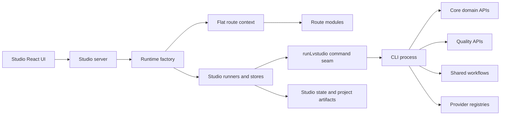
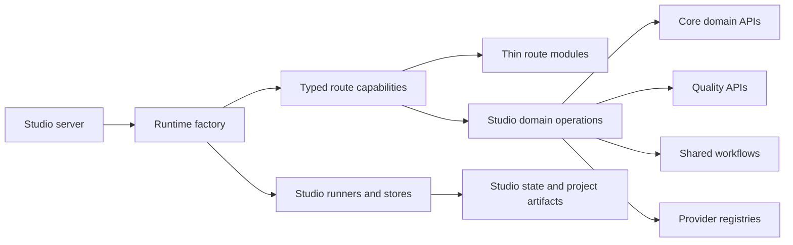

# Studio Boundary Migration Implementation Plan

> **For agentic workers:** REQUIRED SUB-SKILL: Use `superpowers:subagent-driven-development` (recommended) or `superpowers:executing-plans` to implement this plan task-by-task. Steps use checkbox (`- [ ]`) syntax for tracking.

**Goal:** Move Studio's server code into the typed workspace graph and replace command-string orchestration with typed capabilities, without changing HTTP contracts or broad-migrating all modules in one change.

**Architecture:** Keep `server.mjs` as a small composition adapter. First introduce a TypeScript migration seam, then replace the `runLvstudio(args)` command dispatcher with a Studio-owned `DomainOpsCapability` that adapts explicit core, quality, provider, and workflow APIs. Finally replace the flat route dependency bag with grouped capability interfaces. The existing draft planner, image generation, and local state modules remain Studio-owned; they are not candidates for relocation merely because they use files or providers.

**Tech Stack:** pnpm workspace; TypeScript NodeNext; Node built-in test runner; Zod schemas from `@lvstudio/core`; `@lvstudio/quality`; `@lvstudio/providers`; `@lvstudio/workflows`; React/Vite Studio UI.

## Global Constraints

- Prerequisite: merge the quality-gate branch first, then rebase this branch on the resulting `main`. Do not edit root tooling or `.github/` before that point.
- Preserve every public Studio API response shape and stable UI id; route behavior tests are the compatibility contract.
- Zod types exported by `@lvstudio/core` are canonical. Do not recreate schema-shaped Studio types.
- Route modules validate/map HTTP only; runners and domain operations remain named modules with injected dependencies.
- Use the project mutation queue for project-artifact writes. Do not hand-edit generated artifacts.
- A behavior-changing task starts with a failing focused test, then runs its package test and `pnpm -s verify` before its commit.
- Do not port TTS, transcription, or directed voice in-process until explicit per-call runtime config replaces the current child-process environment injection.

---

## Evidence And Current Boundary Map

Evidence read on 2026-06-20:

- `apps/studio/server.mjs`
- `apps/studio/lib/runtime/studio-server-runtime-factory.mjs`
- `apps/studio/lib/runtime/studio-ops.mjs`
- `apps/studio/lib/runtime/studio-runtime-dependencies.mjs`
- `apps/studio/lib/routes/{studio-routes,route-context,routes-*.mjs}`
- `apps/studio/lib/{draft,image,planner,project,tts}/`
- `apps/studio/test/{studio-http-integration,studio-routes-deps,studio-server-runtime-factory,studio-ops-runtime-adapter}.test.mjs`
- `packages/{core,providers,quality,workflows,mcp-server,cli}/src`



All solid edges are explicit imports or calls. The CLI process is an explicit subprocess in `studio-ops.mjs` and `draft/lvstudio-draft-runner.mjs`; it is not an architectural inference.

The target shape removes only the CLI hop for operations that already have stable typed APIs:



`Studio domain operations` is a Studio adapter, not a new domain layer: it maps the existing Studio route/job requirements to package exports and records Studio-specific history. It must not absorb planner, image, or draft-job logic.

## Command Migration Map

| Current command seam | Call sites                                                        | Typed replacement                                            | Status / dependency                                                                                |
| -------------------- | ----------------------------------------------------------------- | ------------------------------------------------------------ | -------------------------------------------------------------------------------------------------- |
| `create`             | `routes-projects-crud`                                            | `createProjectScaffold` plus existing title/plan persistence | Safe after root/build baseline is merged.                                                          |
| `sync`               | CRUD, plan save, assets, image runner, beat runner, prepare draft | `syncProject(projectId, rootDir)`                            | Safe; preserve current queue ownership at callers.                                                 |
| `check`              | plan save, quality route, prepare draft                           | `runQualityChecks(projectId, rootDir)`                       | Safe; map structured result to the current output only at the route/history adapter.               |
| `review`             | quality route                                                     | `reviewProject(projectId, rootDir)`                          | Safe; return structured review data rather than parsing stdout.                                    |
| `render`             | render route, beat regeneration                                   | `runRenderWorkflow` with `rendererProviders`                 | Safe only after preserving `force`, quality, progress, blocked result, and cancellation semantics. |
| `captions`           | prepare draft, beat regeneration                                  | `generateCaptionsForProject`                                 | Safe after the sync capability is present.                                                         |
| `generate:tts`       | prepare draft, beat regeneration, draft runner                    | `generateTTSForProject` + provider registry                  | Blocked: child process currently merges `voiceSettingsEnv(settings)` into per-call environment.    |
| `transcribe`         | prepare draft, beat regeneration, draft runner                    | `transcribeProject` + provider registry                      | Blocked with TTS until explicit runtime/provider config is threaded.                               |
| `direct:voice`       | direct-voice route                                                | CLI `directVoice` helper currently owns configuration        | Blocked until the helper becomes a typed package API with injected config.                         |

### Capability Dependency Map

| Capability  | Current source                                       | Consumers                                    | Ownership after migration                            |
| ----------- | ---------------------------------------------------- | -------------------------------------------- | ---------------------------------------------------- |
| `http`      | `sendJson`, body parsers                             | every route                                  | Studio routes/runtime                                |
| `projects`  | project read/CRUD/media operations                   | project and asset routes                     | Studio; calls core only through `domainOps`          |
| `jobs`      | foreground, draft, beat job runners and state stores | jobs and asset routes                        | Studio                                               |
| `traces`    | run state/trace stores, quality history              | jobs and project routes                      | Studio                                               |
| `voice`     | settings store, preview/health, references           | settings and jobs routes                     | Studio adapter; provider clients remain injected     |
| `domainOps` | replacement for `runLvstudio` / `runLvstudioReport`  | CRUD, plan, quality, jobs, image, beat paths | Studio adapter over core/quality/providers/workflows |

## Sequencing And Integration Gates

1. **Quality gate merges first.** Rebase this branch. Run `pnpm -s verify` and capture the new baseline. Resolve only failures attributable to the rebase before changing Studio behavior.
2. **Type seam next.** The seam requires root script/config changes, so it cannot be committed before step 1. It is a standalone, reversible preparation change.
3. **Typed command capabilities.** Port one command family at a time, retaining stdout-derived compatibility fields at the boundary until the UI moves to structured data.
4. **Route capability grouping.** Do this only after command capabilities have stabilized; grouping a changing flat bag first would multiply churn.
5. **TTS decision checkpoint.** Do not convert env-coupled commands under deadline pressure. Either introduce explicit config in the owning package with tests, or keep the narrow subprocess bridge and document it as managed debt.

## Task 1: Establish The Type Migration Seam

**Files:**

- Create: `apps/studio/tsconfig.json`
- Modify: `apps/studio/package.json`, root `package.json`, `eslint.config.js`
- Delete: `tsconfig.studio.json`
- Test: `apps/studio/test/studio-server-runtime-factory.test.mjs`

**Produces:** TypeScript can resolve a `.mjs` import specifier to a renamed `.mts` source module while unmigrated JavaScript remains executable.

- [ ] Write a focused loader test that imports one renamed leaf fixture through its `.mjs` specifier. Run it first with the fixture absent and record the expected module-resolution failure.
- [ ] Add the Studio-local NodeNext config with `allowJs: true`, `checkJs: false`, `strict: true`, and both `lib/**/*.mjs` and `lib/**/*.mts` includes. Update the Studio test runner to load `tsx` and include `.mts` tests.
- [ ] Update the root `check:studio`, formatting globs, lint file globs, and `studio` start script only after the quality-gate rebase. Preserve all quality-branch changes; resolve conflicts in favor of its root configuration ownership.
- [ ] Rename only `lib/routes/http-utils.mjs` to `.mts`; retain its `.mjs` import specifiers. Run its tests and `pnpm -s check:studio`.
- [ ] Run `pnpm --filter @lvstudio/studio test`, then `pnpm -s verify`; commit `build(studio): add incremental TypeScript migration seam`.

## Task 2: Remove Proven Duplicate Before Broad Type Migration

**Files:**

- Delete: `apps/studio/lib/planner/openai-api-key.mjs`
- Modify: `apps/studio/lib/runtime/studio-server-runtime-factory.mjs`
- Move or delete: `apps/studio/test/openai-api-key.test.mjs`
- Test: `packages/core/test/openai-api-key.test.mjs` if the current coverage is insufficient

**Consumes:** `resolveOpenAiApiKey` from `@lvstudio/core`.

**Produces:** Studio uses the canonical core key resolver and no longer owns a near-duplicate.

- [ ] Add a failing core test only if the existing core suite does not cover both a root `.env` value and an explicit process-env override.
- [ ] Replace the factory's local import with `@lvstudio/core`; move its behavioral test to core or delete it only when equivalent core coverage exists.
- [ ] Delete the local module. Run `pnpm --filter @lvstudio/core test`, `pnpm --filter @lvstudio/studio test`, and `pnpm -s verify`.
- [ ] Commit `refactor(studio): consume canonical OpenAI key resolver`.

## Task 3: Convert Leaf Modules In Dependency Order

**Files:**

- Modify/rename in order: `lib/routes/{http-utils,route-utils,route-context}.mjs`, `lib/runtime/studio-runtime-helpers.mjs`, `lib/project/{run-state-store,run-trace-store,trace-summaries,agent-handoff-store,project-mutation-queue}.mjs`
- Test: the existing module-local tests in `apps/studio/test/`

**Produces:** Typed leaf contracts consumed by the runtime factory without a behavior change.

- [ ] For each module, add/extend a pure-function or store test before changing its source if current tests do not pin its exported behavior.
- [ ] Rename a single module to `.mts`, type every exported parameter and return, use `unknown` plus narrowing for parsed JSON, and import canonical types rather than recreating unions.
- [ ] Run the module's focused test and `pnpm -s check:studio` after each rename.
- [ ] Batch only modules whose importers are still JavaScript; run the Studio test package and `pnpm -s verify` before each conventional commit.

Later batches must follow the actual import graph, not directory order: planner/draft leaves; image and TTS leaves; project operations; routes; runtime wiring; then `server.mjs`. No behavior fixes belong in a rename batch.

## Task 4: Introduce Explicit Domain Operations For Safe Command Families

**Files:**

- Create: `apps/studio/lib/runtime/studio-domain-ops.mts`
- Modify: `apps/studio/lib/runtime/studio-server-runtime-factory.mts`, `studio-runtime-dependencies.mts`
- Modify: relevant route/runner modules only for the command family being ported
- Test: `apps/studio/test/studio-domain-ops.test.mts`, existing route behavior tests

**Interface:**

```ts
export type StudioDomainOps = {
  createProject(input: { projectId: string; mode: string; platform: string }): Promise<void>;
  sync(projectId: string): Promise<SyncResult>;
  check(projectId: string): Promise<QualityResult>;
  review(projectId: string): Promise<ReviewResult>;
  render(input: {
    projectId: string;
    quality: "draft" | "final";
    force: boolean;
  }): Promise<RenderWorkflowResult>;
  captions(projectId: string): Promise<void>;
};
```

- [ ] Add tests with injected package functions. Assert exact command-to-API inputs, root directory propagation, renderer provider selection, and that `render` returns the same bundle inspected by quality.
- [ ] Implement the adapter with imports from package entry points only: `@lvstudio/core`, `@lvstudio/quality`, `@lvstudio/providers`, and `@lvstudio/workflows`. Do not import CLI source files.
- [ ] Port **one** operation family per commit: first sync/check/review, then create, then captions, then render. Preserve `runProjectMutation` and foreground-job ownership in existing callers.
- [ ] For render, map `blocked` distinctly from `rendered`; wire workflow `onStageChange`/`onProgress` to the existing run-state update mechanism before removing the subprocess progress parser.
- [ ] After each family, run its route behavior tests, Studio tests, and `pnpm -s verify` before committing.

## Task 5: Make The TTS Config Decision Explicit

**Files:**

- Inspect: `apps/studio/voice-settings.mts`, `lib/draft/lvstudio-draft-runner.mts`, `packages/core/src/{core-runtime-env,generate-tts,transcribe-project}.ts`, `packages/cli/src/{generate-tts,transcribe,direct-voice}.ts`
- Potentially modify: the owning package's typed operation and test; `studio-domain-ops.mts`

- [ ] Write a failing package-level test that invokes the typed API twice with different voice settings and asserts the calls do not read or mutate global `process.env`.
- [ ] If the test can be satisfied with explicit configuration parameters and injected provider factories, implement that package API, preserve CLI defaults through `core-runtime-env`, then port one Studio command at a time.
- [ ] If the API requires global environment mutation or a cross-package provider redesign, retain only the existing `createLvstudioDraftRunner` subprocess bridge for these commands. Add a focused debt test/documentation note naming the allowed commands; do not broaden it.
- [ ] Run package tests, Studio tests, and `pnpm -s verify` before the decision commit.

## Task 6: Replace Flat Route Dependencies With Typed Capabilities

**Files:**

- Create: `apps/studio/lib/routes/route-capabilities.mts`
- Modify: `lib/runtime/{studio-api-context,studio-runtime-dependencies}.mts`, `lib/routes/{route-context,studio-routes,routes-*.mts}`
- Test: `apps/studio/test/{studio-api-context,studio-routes-deps,studio-routes-behavior}.test.mts`

**Produces:** Route dependency checks operate on named capabilities rather than 50-plus strings and raw Node primitives.

- [ ] Add a failing route-context test for a missing capability (for example `domainOps.sync`) and assert the error names both the route and capability.
- [ ] Define `HttpCapability`, `ProjectsCapability`, `JobsCapability`, `TracesCapability`, `VoiceCapability`, and `DomainOpsCapability`; each member must map to an existing dependency key or a new named adapter method.
- [ ] Migrate route modules in this order: settings, assets, project CRUD, project plan, project quality, projects composition, jobs. One route group per commit with its contract test updates.
- [ ] Remove `STUDIO_ROUTE_CONTEXT_KEYS` only after every route consumes grouped context. Run Studio tests and `pnpm -s verify`; commit `refactor(studio): group route dependencies by capability`.

## Acceptance Criteria

- `apps/studio/server` remains a bootstrap adapter under the existing server-boundary sensor limit.
- Every migrated Studio production module is TypeScript-checked; each `.mjs` to `.mts` rename preserves runtime import compatibility.
- Safe command families no longer spawn `pnpm lvstudio`; no route parses command stdout for those families.
- TTS/transcribe/direct-voice are either fully explicit-config APIs with tests or narrowly documented subprocess residue.
- Route tests exercise the binding layer and report missing capability contracts precisely.
- Each logical commit has focused test evidence and a green `pnpm -s verify` result.

## Risks And Controls

- **Runtime mismatch between `tsx` and production Node:** prove one renamed module through the actual Studio startup script before proceeding past Task 1.
- **Unintentional HTTP contract drift:** port command families behind existing route behavior tests first; retain response mapping at the route boundary.
- **Global configuration contamination:** do not substitute `process.env` mutation for the current child-process environment injection.
- **Runtime factory growth:** Task 4 must extract named adapter factories; do not add another block of assembly logic to `studio-server-runtime-factory`.
- **Root configuration conflict:** the quality-gate branch owns the initial root config/CI changes. Rebase before Task 1 and resolve its changes as the baseline.

## Realizations

- **Problem:** `studio-server-runtime-factory.mjs` assembles almost every runner, store, route dependency, and external client in 578 lines.
  **Impact:** command migration adds dependencies to the same hotspot and makes test setup difficult to isolate.
  **Improvement:** introduce focused capability/adapter factories before migrating behavior; keep the factory to composition only.

- **Problem:** the flat route context exports raw filesystem/process primitives alongside domain actions; `routes-jobs` alone requires a large mixed dependency set.
  **Impact:** route modules can acquire incidental infrastructure dependencies and capability changes have broad test churn.
  **Improvement:** group dependencies by named capability after stable domain operations exist.

- **Problem:** child-process calls hide typed results behind stdout and carry voice configuration through inherited environment state.
  **Impact:** direct in-process migration of TTS commands risks cross-request configuration leaks.
  **Improvement:** port safe structured APIs first and make provider/runtime configuration explicit before removing the narrow remaining subprocess bridge.
